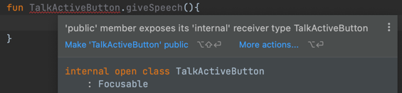

# Kotlin in Action 스터디 2주차 🔥
### 2023-02-12(일)

---


## 3. 함수 정의와 호출
### 3.1 코틀린에서 컬렉션 만들기

코틀린에서 컬렉션을 만들어보자

```kotlin
val set = hashSetOf(1, 7, 53)
val list = arrayListOf(1, 7, 53)
val map = hashMapOf(1 to "one", 7 to "seven", 53 to "fifty-three")
```

위 컬렉션들을 print 해보면 java.util...이 나온다.

코틀린이 자신만의(오로지 코틀린 전용의) 컬렉션 기능을 제공하지 않는다는 것이다.

이로써 자바와 상호 운영하기 쉬워진다. 서로 변환할 필요가 없으니 말이다.

코틀린 컬렉션은 자바와 같은 클래스지만 자바보다 더 많은 기능을 사용할 수 있다.

예를 들면 `.last` `.max` `joinToString` 같은 메소드들이 있다.

코틀린에선 모호한 함수 호출 코드를 방지하거나 오버로딩의 생략을 위해 디폴트 파라미터 값을 설정할 수 있다.

```kotlin
fun<T>joinToString(
    collection: Collection<T>,
    separator: String = ", ",
    prefix: Stiring = "",
    postfix: String = ""
): String
```
이렇게 함수를 구성해두면 디폴트 값이 있기때문에 오버로딩 시 유용하다

> 💡 디폴트 파라미터를 사용해보니 자주 변경하는걸 앞 부분에 위치시키면 더욱 좋습니다!
> + 자바에서 코틀린의 디폴트 파라미터를 사용할 경우 `@JvmOverloads`를 추가해주면 된다!

### 3.3 확장 함수와 확장 프로퍼티

기존 자바코드를 재작성하지 않고 처리하기 위해 확장 함수를 사용할 수 있다.

```kotlin
fun String.lastChar(): Char = this[this.length - 1]
>> println("Kotlin".lastChar())
```
위에서 `String`을 수신 객체타입이라고 부른다.

- 여러 확장함수를 사용하다보면 충돌이 일어날 수 있는데 이때 `as` 키워드를 사용해 다름이름으로도 부를 수 있다.
- 확장함수는 클래스의 일부가 아니며 첫 번째 인자가 수신 객체인 정적 자바 메소드로 컴파일하기때문에 오버라이드를 할 수 없다.

### 3.4 컬렉션 처리

- 가변인자(vararg)를 이용해 원하는 개수만큼 인자를 넘길 수 있다.

```kotlin
fun main(args: Array<String>){
    val list = listOf("args: ", *args) // 스프레드 연산자가 배열의 내용을 펼쳐준다.
}
```

- 값의 쌍을 다룰 때 중위 호출을 이용할 수 있다.
```kotlin
val map = mapOf(1 to "one", 7 to "seven", 53 to "fifty-three")
```
위에서 `to`는 코틀린 키워드가 아니다. 중위 호출이라는 방식으로 to라는 일반 메서드를 호출한 것이다.

- 메서드를 중위 호출에 사용하게 허용하고 싶으면 infix 변경자를 메서드 선언 앞에 추가해줘야한다. (to의 경우 Tuple.kt에 infix 처리 되어있다.)
- to 메서드는 Pair를 반환하기 때문에 `val (number, name) = 1 to "one"` 와 같이 동시에 두 변수를 즉시 초기화 할 수 있다. 이것을 구조 분해 선언이라고 부른다.

### 3.6 코드 다듬기: 로컬 함수와 확장
> 😎 DRY: Don't Repeat Yourself

좋은 코드이 무엇이냐 묻는다면 개발자들마다 의견들이 분분하겠지만 중복 없는 코드라는 점은 입을 모아 말할 것이다.

중복을 피하기 위해 기존엔 내부 클래스(inner class)를 사용했지만 그에 따른 불필요한 준비 코드가 늘어난다.

이를 개선하기 위해 코틀린에선 더 깔끔한 해법이 있다!

바로 로컬 함수이다. 책에 나온 예제를 보며 천천히 리팩토링 해보며 이해 해보자.

#### 사용자 데이터를 데이터베이스에 저장하기 전 객체를 검증하는 과정을 거치는 경우

```kotlin
class User(val id: Int, val name: String, val address: String)

fun saveUser(user: User){
    if(user.name.isEmpty()){
        // throw error
    }
    if(user.address.isEmpty()){
        // throw error
    }
    
    // save user
}
```

위 코드에서 `name`, `address` 프로퍼티 값이 있는지 중복 체크를 진행하고 있다.

로컬 함수를 이용해 중복을 줄인 코드를 보자.

```kotlin
class User(val id: Int, val name: String, val address: String)

fun saveUser(user: User){
    fun validate(value: String){
        if(value.isEmpty()){
            // throw error
            // 로컬함수는 바깥 함수의 파라미터를 사용할 수 있다!
        }
    }
    validate(user.name)
    validate(user.address)
    
    // save user
}
```

중복되던 if구문을 깔끔하게 줄인걸 확인할 수 있다. 여기에 그치지 않고 더 개선하고 싶다면?

만들어둔 `User`클래스의 확장 함수를 만들어주자.

```kotlin
class User(val id: Int, val name: String, val address: String)

fun User.validateBeforeSave(){
    fun validate(value: String){
        if(value.isEmpty()){
            // throw error
        }
    }
    validate(user.name)
    validate(user.address)
}

fun saveUser(user: User){
    user.validateBeforeSave()
    // save user
}
```

위 예시는 `User`클래스에서 검증 로직으로만 사용할 기능이기 때문에 User를 간결하게 유지하면서 중복을 줄일 수 있다.

다만 로컬함수의 경우 중첩될 경우 코드 가독성이 떨어지기 때문에 일반적으로 한단계의 로컬 함수가 권장된다.

## 4. 클래스, 객체, 인터페이스

### 4.1 클래스의 계층 정의

한 클래스에 두개 이상의 인터페이스를 구현하는데 동일한 메소드명 `showoff()`이 존재한다면 
```kotlin
class Button: Clickable, Focusable {
    override fun showOff(){
        super<Clickable>.showOff()
        super<Focusable>.showOff()
    }
}
```

`super<상위 타입 이름>`을 이용해 어떤 상위 타입의 멤버 메소드를 호출할지 지정할 수 있다.

기존 자바에서는 `final` 키워드를 붙이지 않으면 기본적으로 상속이 가능하다.

하지만 기반 클래스를 작성한 사람의 의도와 다른 방식으로 오버라이드 할 경우 위험이 존재한다.

모든 하위 클래스를 분석하는 것은 불가능하기 떄문에 기반 클래스는 취약하다.

> 상속을 위한 설계와 문서를 갖추거나, 그럴 수 없다면 상속을 금지하라.
> 
>`Effective Java` 저자 Joshua Block


```kotlin
open class RichButton: Clickable {
    fun disable(){} // 오버라이드 불가느 
    open fun animate() {} // 오버라이드 가능
    override fun click() {} // 오버라이드 함수, 오버라이드 가능
    final override fun clickLong() {} // 오버라이드 함수, 오버라이드 불가능
}
```

### 상속 관련 키워드

| 변경자      | 이 변경자가 붙은 멤버는 | 설명                                |
|----------|---------------|-----------------------------------|
| final    | 오버라이드 할 수 없음  | 클래스의 멤버의 기본 변경자                   |
| open     | 오버라이드 할 수 있음  | 반드시 open을 명시해야 오버라이드 가능           |
| abstract | 반드시 오버라이드해야 함 | 추상 클래스의 멤버에만 사용 가능, 추상 멤버에는 구현 불가 |


### 접근 제어자 키워드

| 변경자       | 클래스 멤버             | 
|-----------|--------------------|
| public    | 모든 곳에서 볼 수 있음      | 
| internal  | 같은 모듈 안에서만 볼 수 있음  | 
| protected | 하위 클래스 안에서만 볼 수 있음 | 
| private   | 같은 클래스 안에서만 볼 수 있음 | 

```kotlin
internal open class TalkActiveButton: Focusable {
    private fun yell() = println("Hey!")
    protected fun whisper() = println("Let's talk!")
}
``` 
위와 같이 클래스를 정의하고 확장함수를 만든다면 확장함수의 가시성이 더 높기때문에 에러를 뿜는다.



- 중첩 클래스 사용 시 코틀린에선 기본적으로 바깥 클래스에 대한 참조를 저장하지 않는다. 참조를 저장하기 위해선 `inner` 키워드를 붙여주면 된다.
- `sealed` 키워드를 이용해 상위 클래스를 상속한 하위 클래스의 정의를 제한할 수 있다.


### 4.2 뻔하지 않은 생성자와 프로퍼티를 갖는 클래스 선언
- 주 생성자에서 파라미터를 만들고 디폴트 값도 설정할 수 있다.
- 생성자가 여럿 필요한 경우 부 생성자들을 만들어줄 수 있다. 
```kotlin
open class View{
    constructor(ctx: Context){
        // code
    }

    constructor(ctx: Context, attr: AttributeSet){
        // code
    }
}
```

```kotlin
// 자신에 대응하는 상위 클래스 생성자를 호출하여 생성을 위임한다.
class MyButton: View{
    constructor(ctx: Context): super(ctx){
        ...
    }
    constructor(ctx: Context, attr: AttributeSet): super(ctx,attr){
        ...
    }
}
```

```kotlin
// 첫 번째 부 생성자가 두번째 부생성자에게 생성을 위임하고 있고 
// 최종적으로 상위 클래스 생성자를 호출하고 있다(해야 하기도 하다.)
class MyButton: View{
    constructor(ctx: Context): this(ctx, MY_STYLE){
        ...
    }
    constructor(ctx: Context, attr: AttributeSet): super(ctx,attr){
        ...
    }
}
```

- 인터페이스에 선언된 프로퍼티를 구현하는 방법은 다음과 같다
```kotlin
interface User {
    val nickName: String
}

class PrivateUser(override val nickName: String): User

class SubscribingUser(val email: String): User {
    override val nickName: String
        get() = email.substringBefore('@') // 호출 시 매번 계산
}

class FaceBookUser(val accountId: Int): User {
    override val nickName: String = getFacebookName(accountId) // 객체 초기화 시 한번만 호출하고 저장
}
```

여기에서 `SubscribingUser`와 `FaceBookUser` 설계 차이가 중요하다. 비용이 많이 들 수 있다.

- 클래스에 구현된 프로퍼티는 `set`와 `get`를 이용해 정해직 로직을 실행할 수 있다.
- `set`와 `get`의 가시성을 변경하여 프로퍼티의 가시성을 변경할 수 있다.